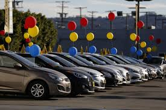
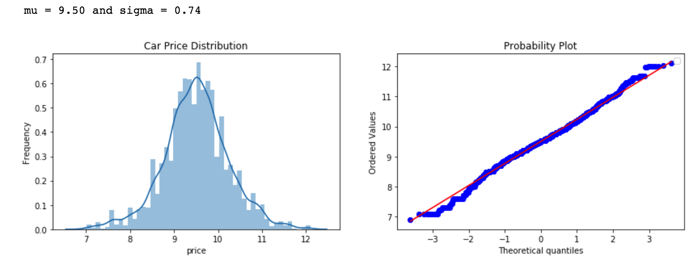
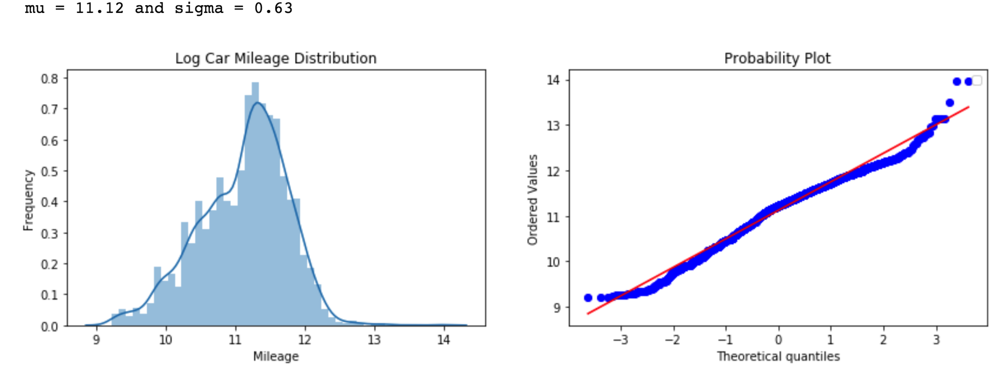
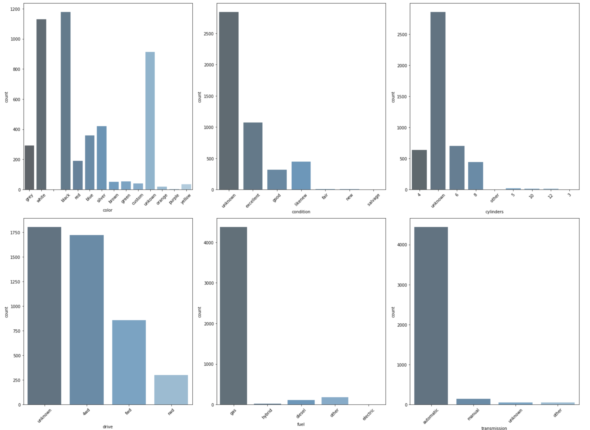
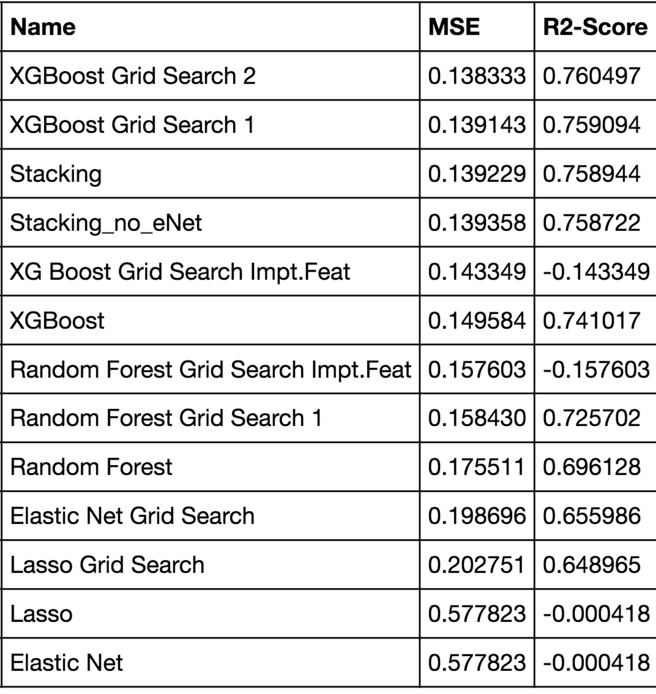
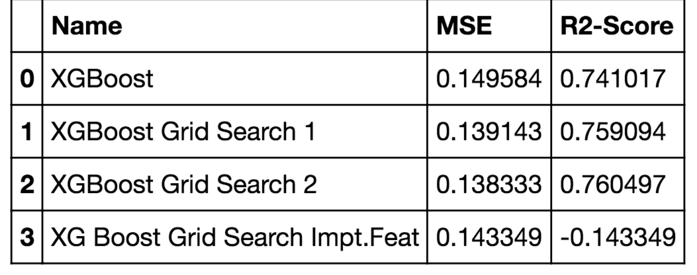

<h2>Predicting Used Car Sale Prices using Machine Learning: Project Overview<h2>

  

- Using the Craiglist used car dataset from Kaggle, the aim of this project was to determine the optimal car price based on the various features provided.
- Optimized Lasso, Elastic Net, XG Boost, Random Forest, and a Stacked Model using Gridsearch CV to reach the best model. 

Code and Resources Used:
---
Python Version: 3.7
Packages: pandas, numpy, sklearn, matplotlib, re, scipy,sklearn, mlxtend, and xgboost
Dataset: https://www.kaggle.com/austinreese/craigslist-carstrucks-data

Data Cleaning
---
After reading in the data, I needed to clean it up so that it was usable for the model.
Following Changes: 
- Fill in missing values with 'unknown'
- Removed rows with out a price 
- Changed Column Types 
- Took the logarithmic of both the price and odometer to form a normal distribution.

EDA
--
- Looked the distribution and value counts for the various categorical variables. Below are a few highlights:

Model Building
--
First, I took 15% of the dataset to use for model building. I transformed the categorical variables into dummy variables. I also split the data into train and tests sets with a test size of 35%. 
I tried six models and evaluated them using the Mean Squared Error and the R-Squared Score. I chose both because it is relatively easy to interpret. 
Models: 

Model Performance 
--
The XG Boost model far outperformed the other approaches on the test and training sets. It could possibly be improved further with hyper-parameter tuning. Thus, XGBoost was able to predict 76% of the variation of car sale prices.

